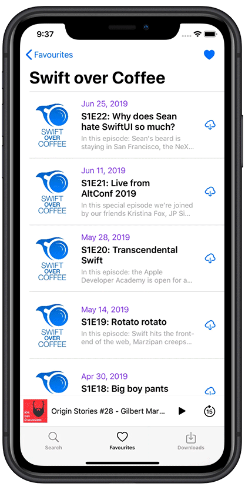

## Hello!
Этот репозиторий используется в качестве пополняемого портфолио проектов. Спасибо за интерес!

This repo serves as ever-changing portfolio of my projects. Please feel free to look around!

# AppStore JSON
`UICollectionView` ` Animations ` ` GCD ` ` JSON ` ` Decodable `  ` SDWebImage ` 

[AppStore JSON](https://github.com/sknerd/AppStoreJSON) – приложение-аналог AppStore с ипользованием iTunes API для практики работы с JSON и Decodable. Верстка в коде, приятные анимации и визуальные эффекты.

[AppStore JSON](https://github.com/sknerd/AppStoreJSON) recreates Apple's AppStore using iTunes API to practice JSON parsing and working with Decodable. Layed out in code with nice animations and visual effects.

&nbsp;&nbsp;
&nbsp;&nbsp;
&nbsp;&nbsp;
&nbsp;&nbsp;

# GameSetMatch
`UIKit` `Animations` `Firebase` `Auth` `MVVM` `Messaging`

[GameSetMatch](https://github.com/sknerd/GameSetMatch) – это клон приложения Tinder, выполненный на основне Google Cloud Firestore с интересными анимациями, аутентификацией и живым чатом.

[GameSetMatch](https://github.com/sknerd/GameSetMatch) is a tinder clone app to practice working with Google Cloud Firestore, animations, authentication, networking and more.

&nbsp;&nbsp
&nbsp;&nbsp;
&nbsp;&nbsp;
&nbsp;&nbsp;

# CocoaPodcasts
`AVKit` `UIKit` `Animations` `iTunes API` `Alamofire` `JSON`

[CocoaPodcasts](https://github.com/sknerd/CocoaPodcasts) — простое приложения для поиска и проигрывания подкастов с помощью iTunes API с возможностью сохранения в офлайн.

[CocoaPodcasts](https://github.com/sknerd/CocoaPodcasts) — simple Podcast application based on iTunes API with ability to search, play, favourite and download episodes.

&nbsp;&nbsp
&nbsp;&nbsp;
&nbsp;&nbsp;
&nbsp;&nbsp;

# Maps&Places
`MapKit` `UIKit` `Google Places` `SwiftUI`

[Maps&Places](https://github.com/sknerd/Maps-Places) — программа на базе MapKit c интеграцией Google Places SDK. Локальный поиск, информация об объектах, возможность прокладывать маршрут. При написании использовались SwiftUI превью.

[Maps&Places](https://github.com/sknerd/Maps-Places) — MapKit app with local search, annotations and directions. Integrates Google Places SDK. Prototyped using SwiftUI Previews.

&nbsp;&nbsp
&nbsp;&nbsp;
&nbsp;&nbsp;
&nbsp;&nbsp;

# Instagram Firebase
`UIStackView` `AVFoundation` `Firebase` `Auth` `Storage`

[Instagram Firebase](https://github.com/sknerd/InstagramFirebase) — программа создавалась с целью закрепления навыка работы с Google Firebase и сетевыми запросами.

[Instagram Firebase](https://github.com/sknerd/InstagramFirebase) — Instagram-like app to gain Firebase and Networking skills.

&nbsp;&nbsp
&nbsp;&nbsp;

#### Спасибо за внимание! Thanks for stopping by!

# Contact:

- e-mail: renald.shchetinin@gmail.com
